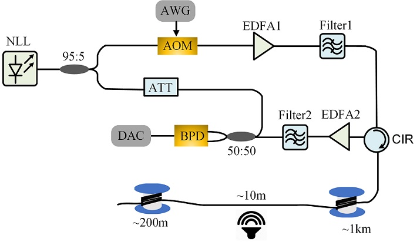
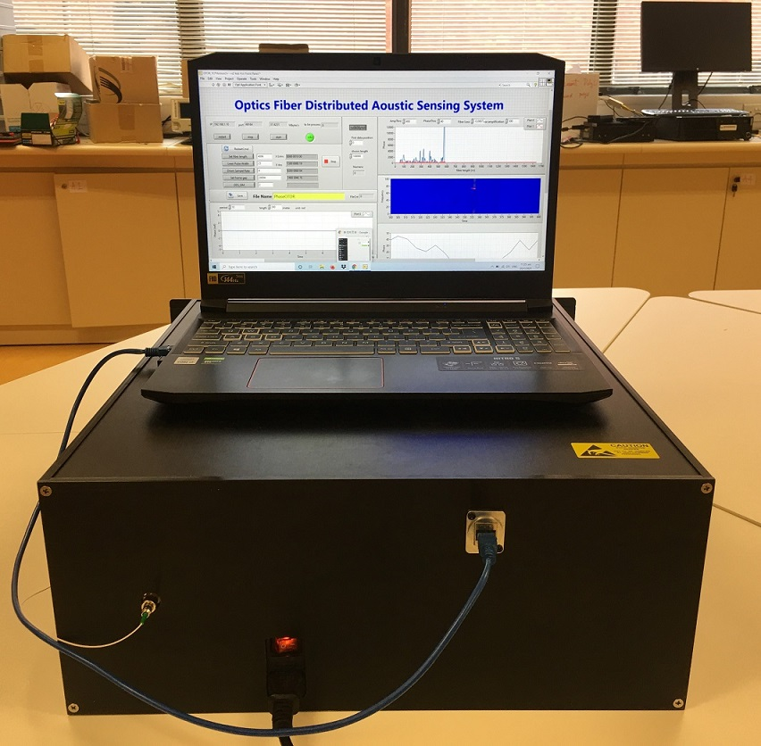
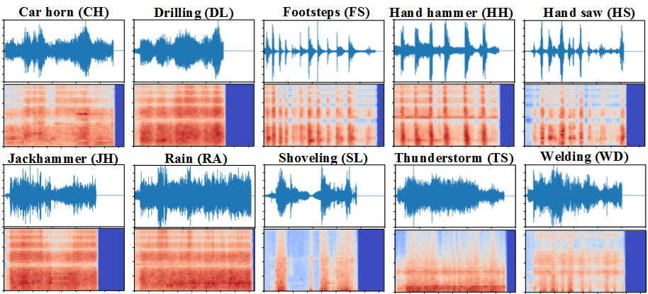
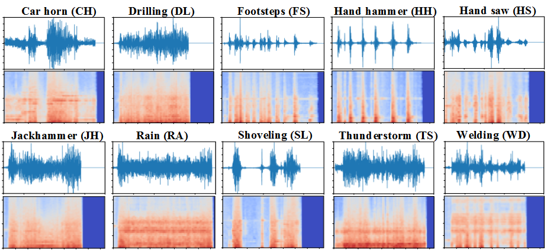
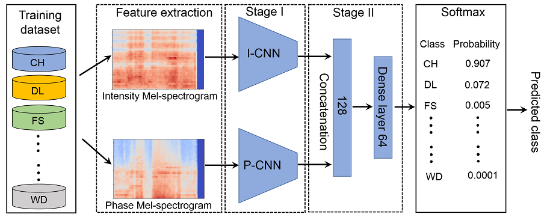
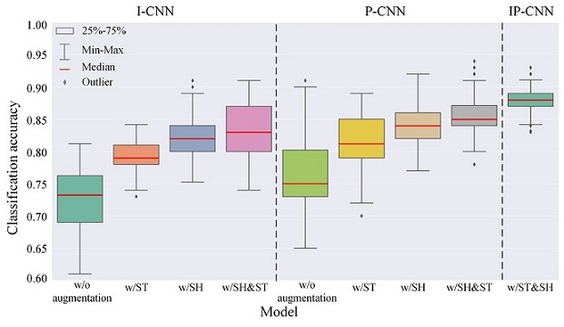
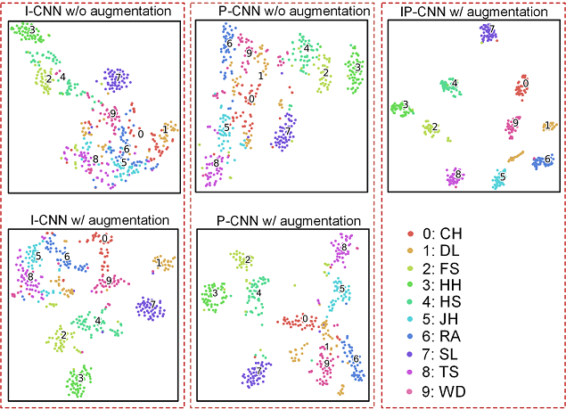

### Pattern recognition in distributed fiber-optic acoustic sensor using an intensity and phase stacked convolutional neural network with data augmentation

### Citation
When using this resource, please cite the following publication:

> Pattern recognition in distributed fiber-optic acoustic sensor using an intensity and phase stacked convolutional neural network with data augmentation. Optics Express, 29(3), 3269-3283, 2021.
---------------------------

### DAS experimental setup
A narrow-linewidth laser (NLL, _Connect CoSF-SC-1550-M_) with 5 kHz linewidth is used as the optical source. The output of the NLL is split into two branches with a 95:5 coupler. In the upper branch, the continuous wave is firstly modulated by an acousto-optic modulator (AOM, _G&H T-M080-0.4C2J-3-F2S_) to generate an optical pulse sequence with an 80 MHz frequency shift. An erbium-doped fiber amplifier (EDFA, Amonics _AEDFA-18-M-FA_) is used to boost the power of the optical pulses. The amplified spontaneous emission (ASE) noise is filtered out by an optical bandpass filter with 0.8nm passband. Then the optical pulses are launched into the fiber-under-test (FUT). The Rayleigh backscattering (RBS) traces are further amplified by another EDFA and followed by another 0.8 nm bandpass filter. Finally, the RBS light is combined with the optical local oscillator from the lower branch and launched into a balanced photo-detector (BPD, _Thorlabs PDB465C_). The data are collected by a 14-bit data acquisition card (DAC) with a sampling rate of 250MS/s. The intensity and phase information are demodulated by Hilbert transform and down-sampled to 15.625MS/s, then the distributed phases at all sensing locations are unwrapped independently to restore the acoustic waveforms. The Hilbert transform and the phase unwrapping algorithms are embedded in the field programmable gate array (FPGA) chip (_Zynq-7100, Xilinx Inc._) of the DAC. Benefiting from the parallel computing ability of the FPGA, the distributed acoustic waveforms can be extracted in real-time. In this experiment, the sensing fiber is G. 652 single-mode fiber (SMF) and the total length is around 1.2km. The pulse repetition rate is set to 10 kHz and the pulse width is 100ns. The vibration is applied through a speaker with 10m fiber stick on it around 1010 m.

Experimental setup             |  Prototype
:-------------------------:|:-------------------------:
     |  

---------------------------

### Data description
This dataset contains 501 labeled intensity and phase waveforms at speaker position. Then classes are summarized in Table 1. In each class, it has 47 to 54 samples, the duration of each sample varies from 0.9s to 4.95s, with a total time of 1816.6s. 

##### Table 1 DAS1K dataset description
Number | Class| Number of samples | Duration of each sample|
-------|------|-------------------|---------------|
  0    | car horn |48|1.85-4.95s|
  1    |drilling | 50| 0.90-4.34s|
  2    |footsteps| 50| 2.05-4.65s|
  3    |hand hammer| 54| 2.55-4.35s|
  4    |hand saw| 53| 3.15-4.75s|
  5    |jackhammer| 47| 0.90-4.14s|
  6    |raining| 49| 3.35-4.83s|
  7    |shoveling| 53| 1.15-4.04s|
  8    |thunderstorm| 48| 2.85-4.74s|
  9    |welding| 49| 3.35-4.04s|
  10   |Total| 501| 1816.6s|

---------------------------

### Code dependencies
* Python 3.7
* numpy
* librosa
* matplotlib
* scikit-learn
* tensorflow
* keras
---------------------------

### Feature extraction - Mel spectrogram
There are many signal representations can be extracted from the time-series signal, it has been noted that time-frequency representations are especially useful as learning features due to the non-stationary dynamic nature of the waveforms. In this work, we used Librosa to extract log-scaled Mel-spectrogram as the feature vector. The following two figures depict the information of 10 representative waveforms from each class of the dataset. 

Intensity             |  Phase
:-------------------------:|:-------------------------:
      |  

---------------------------

### Classification model
The architecture of 2D CNN model is shown in Table 2. To utilize the intensity and phase information simultaneously, we used an intensity and phase stacked model (IP-CNN). The output of two CNNs are concantenated to form a 128-D feature vector. This feature vector passes a dense layer and finally be projected to 10 predicted classes. 

##### Table 2 The architecture of 2D CNN Model	

Layer  | Name   |Kernel size|Number of IFM/OFM|Output shape|Number of parameters|
-------|--------|-----------|-----------------|------------|-------------------|
  1    |Input   |-          |-                |(40,95)     |-                  |   
  2    |Conv2D  |(3,3)      | 1/16            |(38,96)     |160                |     
  3    |MaxPooling2D|(2,2)  | 16/16           |(19,48)     |0                  |
  4    |Conv2D  | (3,3)     | 16/32           |(17,46)     |4640               |
  5    |MaxPooling2D| (2,2) | 32/32           |(8,23)      |0                  |
  6    |Conv2D  | (3,3)     | 32/64           |(6,21)      |18496              |
  7    |MaxPooling2D|(2,2)  | 64/64           |(3,10)      |0                  |
  8    |Conv2D  | (3,3)     |64/64            |(3,10)      |18496              |
  9    |MaxPooling2D| (2,2)| 64/64            |  (1,5)       |0           |
  10   |Global average pooling 2D| -|-     |(1,64)         |0                  |
  11   |Dense   |(1,1)      |-                |(None,10)   |650          |

##### Training flow of the proposed IP-CNN model 

---------------------------

### Data augmentation
Data augmentation is a common strategy to create new training samples by tweaking small factors on the **training samples**. By changing these small factors, we can increase the number of the datasets. which not only improves the generalization capability of the model but also avoids overfitting. In this work, we performed two different data augmentations, i.e., stretching and shifting.
* **Stretching (ST)**: slow down or speed up both the intensity and phase signals. Each signal is streatched by four factors: {0.8, 0.9, 1.1, 1.2}.
* **Shifting (SH)**: circular shift both the intensity and phase signals by 3 different percentages of the signal length: {0.2, 0.4, 0.6}.
  
---------------------------

### Performances
The effectiveness of data augmentation and stacking intensity and phase are compared. 

---------------------------

### Feature visualization
To illustrate the discrimination capability of five CNN models on each class, the features extracted at the final dense layer are embedded into the 2D plane using the t-SNE toolbox. The learned features in IP-CNN with data augmentation construct a map in which the separation among these ten classes is almost perfect. This validates the effectiveness of utilizing both the intensity and phase information for classification accuracy improvement.

--------------
### Dataset created by
_Huan Wu_ (The Hong Kong Polytechnic Univeristy), _Kun Zhu_ (The Hong Kong Polytechnic University), _Bin Zhou_ (South China Normal University)

Please download the dataset from our project website :upside_down_face:

:point_right: [https://dasdataset.eie.polyu.edu.hk/](https://dasdataset.eie.polyu.edu.hk/).

